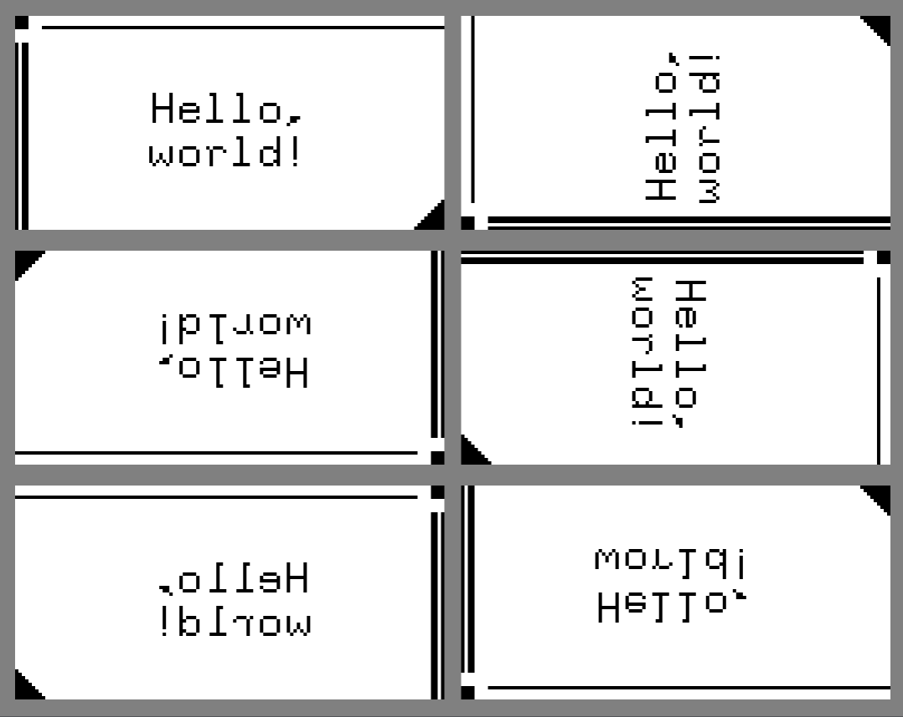

# Embedded graphics coordinate transforms

Wrappers for rotating, mirroring, and transposing embedded graphics displays.

## Minimum supported Rust version

The `embedded-graphics-coordinate-transform` crate is tested to compile on the latest stable Rust release.

## License

Licensed under either of

- Apache License, Version 2.0 ([LICENSE-APACHE](LICENSE-APACHE) or http://www.apache.org/licenses/LICENSE-2.0)
- MIT license ([LICENSE-MIT](LICENSE-MIT) or http://opensource.org/licenses/MIT)

at your option.

### Contribution

Unless you explicitly state otherwise, any contribution intentionally submitted for inclusion in the
work by you, as defined in the Apache-2.0 license, shall be dual licensed as above, without any
additional terms or conditions.